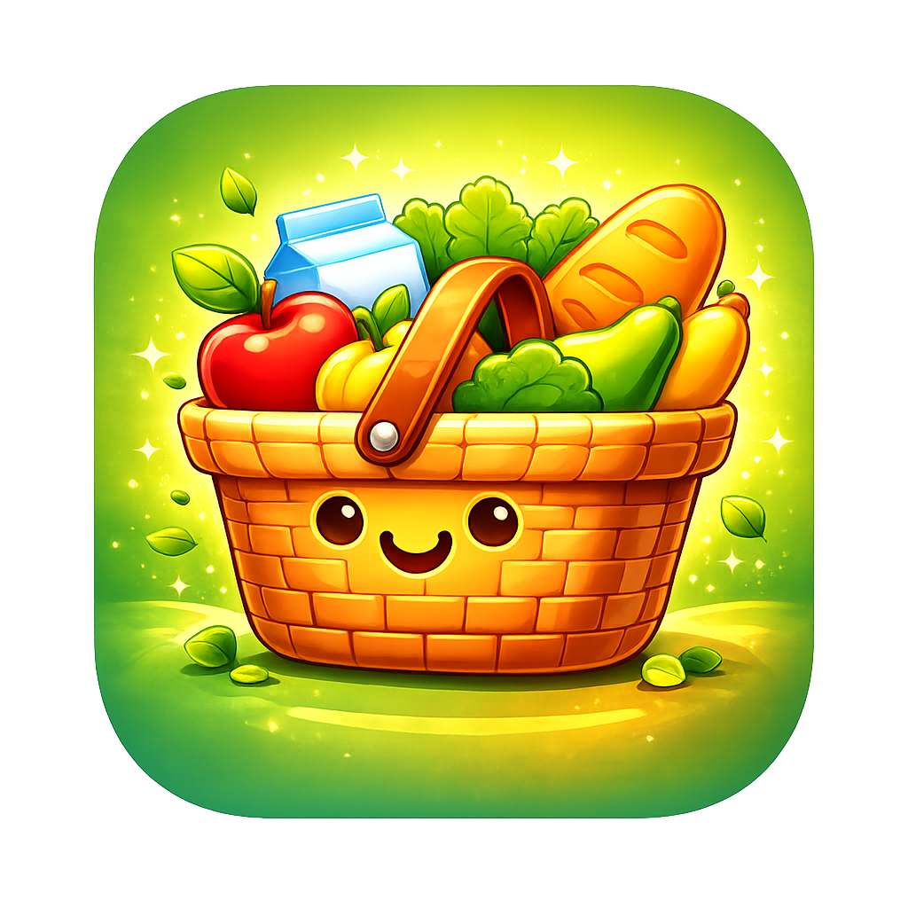
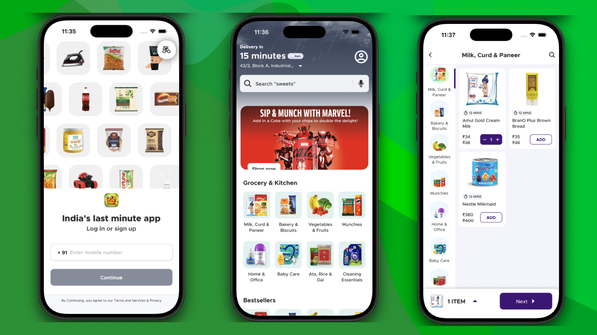
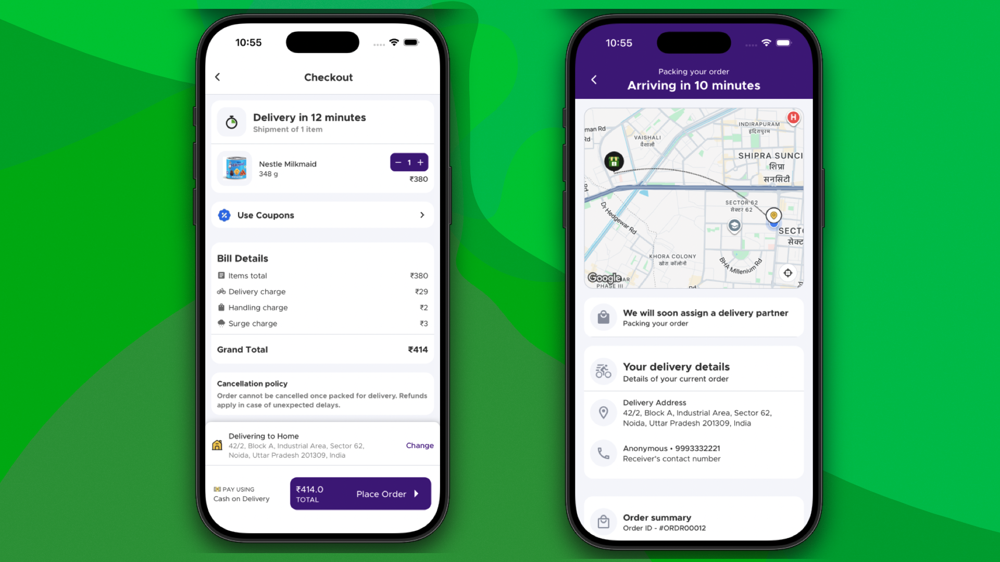
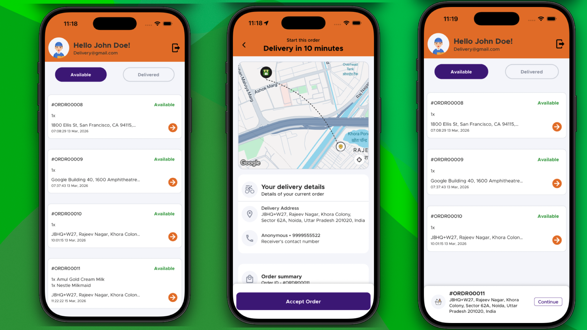

<div align="center">



<h1>🛒 FreshMart</h1>

<strong>A modern grocery delivery app built with React Native CLI</strong>

<em>Live order tracking · Google Maps integration · Gesture-driven UI · Production architecture</em>

<br />

<a href="https://reactnative.dev/"></a>
<a href="https://www.typescriptlang.org/"></a>
<a href="https://zustand-demo.pmnd.rs/"></a>
<a href="https://socket.io/"></a>
<a href="LICENSE"></a>

<br /><br />

<a href="#-features">Features</a> · <a href="#-tech-stack">Tech Stack</a> · <a href="#-architecture">Architecture</a> · <a href="#-getting-started">Getting Started</a> · <a href="#-screenshots">Screenshots</a> · <a href="#-demo">Demo</a>

</div>

---

## 📱 Overview

FreshMart is a production-grade grocery delivery app that demonstrates how to build a real-world mobile platform with React Native CLI. From live delivery partner tracking on Google Maps to real-time Socket.IO order updates, every feature is built with scalability and performance in mind.

> Built as a portfolio project to showcase React Native development patterns including gesture UI, high-performance animations, real-time communication, and clean feature-based architecture.

---

## ✨ Features

| Feature                        | Description                                                    |
| ------------------------------ | -------------------------------------------------------------- |
| 🛍 **Product Browsing**         | Browse products across categories with a smooth, responsive UI |
| 🛒 **Cart Management**         | Add, remove, and manage cart items with instant state updates  |
| 🔐 **Authentication**          | Secure login flow with persistent session via MMKV             |
| 📦 **Order Tracking**          | Track your order from placement to delivery                    |
| 🚚 **Live Delivery Updates**   | Real-time driver location and status via Socket.IO             |
| 🗺️ **Google Maps**             | Turn-by-turn delivery route with live driver marker            |
| ⚡ **Fluid Animations**        | 60fps gesture-driven interactions powered by Reanimated        |
| 🎬 **Lottie Micro-animations** | Delightful feedback animations for key interactions            |

---

## 🧱 Tech Stack

| Technology                  | Purpose                                     |
| --------------------------- | ------------------------------------------- |
| **React Native CLI**        | Core mobile framework                       |
| **TypeScript**              | Full type safety across the codebase        |
| **React Navigation v7**     | Stack, tab & modal navigation               |
| **Zustand**                 | Lightweight global state management         |
| **Axios**                   | HTTP client for API communication           |
| **Socket.IO**               | Real-time event-driven communication        |
| **React Native Maps**       | Google Maps integration                     |
| **React Native Reanimated** | High-performance UI thread animations       |
| **MMKV**                    | Ultra-fast persistent key-value storage     |
| **Lottie**                  | JSON-based UI animations                    |

---

## 📂 Project Structure

```
FreshMart/
├── android/
├── ios/
└── src/
    ├── assets/          # Images, Lottie JSONs, fonts
    ├── components/      # Shared UI components
    ├── features/        # Feature modules (auth, cart, orders, map)
    ├── navigation/      # Stack and tab navigators
    ├── service/         # Axios instances and API calls
    ├── state/           # Zustand stores
    ├── styles/          # Global theme tokens & style utilities
    └── utils/           # Helper functions
```

---

## 🏗 Architecture

```
┌─────────────────────────────────────┐
│           UI Components             │  ← Reanimated + Gesture Handler
├─────────────────────────────────────┤
│          Feature Modules            │  ← auth, cart, orders, map
├─────────────────────────────────────┤
│      State Management (Zustand)     │  ← authStore · cartStore · mapStore
├─────────────────────────────────────┤
│       API Services (Axios)          │  ← REST + Socket.IO
├─────────────────────────────────────┤
│        Backend / Socket Server      │
└─────────────────────────────────────┘
```

This architecture enables:

- ✅ Modular, feature-scoped code
- ✅ Clear separation of concerns
- ✅ Painless state management without boilerplate

---

## 🧠 State Management

Three Zustand stores power the app's global state:

| Store       | Responsibility                          |
| ----------- | --------------------------------------- |
| `authStore` | User auth details, tokens, login/logout |
| `cartStore` | Cart items, quantities, computed totals |
| `mapStore`  | Delivery coordinates, driver location   |

**Why Zustand?** Minimal API, zero boilerplate, excellent performance — no Redux ceremony required.

---

## 📍 Maps & Location

Google Maps powers the live delivery tracking screen.

- **Libraries:** `react-native-maps`, `react-native-maps-directions`, `@react-native-community/geolocation`
- **Capabilities:** Fetch user's current coordinates · Display Google Maps / Apple Maps · Draw route between origin and destination

---

## ⚡ Real-Time Updates

Socket.IO handles all real-time communication between the app and server:

- 📡 Order status changes (confirmed → preparing → out for delivery → delivered)
- 📍 Driver location updates (live map marker movement)
- 🔔 Delivery progress events

---

## 💾 Storage

Persistent data is stored using **MMKV** — significantly faster than AsyncStorage with native encryption support.

Used for: authentication tokens · cart item storage

---

## 📸 Screenshots

| Auth, Home, Category                             | Order & Live Tracking                              | Delivery                               |
| ------------------------------------------------ | -------------------------------------------------- | -------------------------------------- |
|  |  |  |

---

## 🎬 Demo

<div align="center">

<h3>Watch the full app walkthrough on YouTube</h3>

<br />

<a href="https://youtu.be/gz0ZVGn4HCI">
  
</a>

<br /><br />

<p><a href="https://youtu.be/gz0ZVGn4HCI"><strong>▶ Watch on YouTube</strong></a> — Full walkthrough covering auth flow, cart, live order tracking, and Google Maps integration.</p>

</div>

---

## 🚀 Getting Started

### Prerequisites

- Node.js ≥ 18
- React Native CLI environment ([setup guide](https://reactnative.dev/docs/environment-setup))
- Android Studio or Xcode

### Installation

```bash
# Clone the repository
git clone https://github.com/krishnakmr08/react-native-freshmart.git
cd react-native-freshmart

# Install dependencies
npm install

# iOS only — install CocoaPods
npm run pod-install
```

### Running the App

```bash
# Start Metro bundler
npm start

# Run on Android
npm run android

# Run on iOS
npm run ios
```

---

## 🗺️ Future Improvements

- [ ] Payment gateway integration
- [ ] Phone number authentication with OTP
- [ ] Push notifications
- [ ] Wishlist / favorites
- [ ] Multi-address support
- [ ] In-app chat with delivery driver

---

## 📜 License

Distributed under the MIT License. See [`LICENSE`](LICENSE) for details.

---

## 👨‍💻 Author

**Krishna Kumar**

[](https://github.com/krishnakmr08)

---

<div align="center">

⭐ <strong>If FreshMart was helpful or interesting, drop a star — it helps a lot!</strong>

</div>